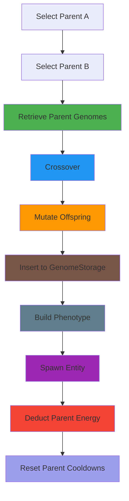

# Module: Reproduction System

## Overview

The reproduction system handles sexual reproduction with preference-based mate selection, enabling evolutionary dynamics in the simulation. It manages parent selection, genome crossover, mutation, and offspring spawning with energy costs and cooldown timers.

## Files

- `sim/include/evolution/sim/reproduction_system.h`
- `sim/src/reproduction_system.cpp`

## Classes

### ReproductionSystem

**Purpose**: Preference-driven mate selection and reproduction for evolutionary simulation.

**Responsibilities**:
- Identify eligible parents based on energy and cooldown
- Find candidate mates within mate radius
- Evaluate mate preference using neural networks or trait similarity
- Perform genome crossover and mutation
- Spawn offspring with proper phenotype
- Deduct energy costs from parents
- Emit telemetry events for spawns and lineage links
- Support asexual fallback when no mate available

**Public API**:

```cpp
// Construction
explicit ReproductionSystem(genetics::GenomeStorage& storage,
                           const genetics::ReproConfig& config,
                           std::uint64_t global_seed) noexcept;

// System interface
void tick(SimulationContext& context) override;
[[nodiscard]] std::string_view name() const noexcept override;

// Configuration
void set_asexual_fallback(bool enabled) noexcept;
```

**Parameters**:

- `storage` (constructor):
  - Type: `genetics::GenomeStorage&`
  - Meaning: Genome storage containing all registered genomes
  - Must outlive system instance
  - Used for: parent genome lookup, child genome insertion

- `config` (constructor):
  - Type: `const genetics::ReproConfig&`
  - Meaning: Reproduction parameters (crossover rates, mutation rates)
  - Contains: crossover_prob, mutation_rates, gene_weights

- `global_seed` (constructor):
  - Type: `std::uint64_t`
  - Meaning: Deterministic seed for RNG operations
  - Ensures reproducible reproduction decisions

- `enabled` (set_asexual_fallback):
  - Type: `bool`
  - Meaning: Enable asexual reproduction when no mate found
  - Default: `false` (sexual reproduction only)
  - Use case: Small populations where mates unavailable

**Returns**:

- `name()` → `std::string_view` literal `"reproduction"`
- `tick()` and `set_asexual_fallback()` return `void`

**State Management**:

- `storage_`: Reference to genome storage (owned by caller)
- `config_`: Reproduction configuration parameters
- `global_seed_`: Global RNG seed for deterministic behavior
- `asexual_fallback_`: Asexual reproduction flag
- `candidate_buffer_`: Scratch buffer for mate candidates
- `preference_input_buffer_`: Reusable buffer for preference network inputs
- `preference_output_buffer_`: Reusable buffer for preference network outputs

**Execution Algorithm**:

```
For each eligible parent entity:
    1. Check energy >= energy_threshold and cooldown <= 0
    2. Find candidates within mate_radius:
        - Exclude self
        - Filter by cooldown and energy
    3. For each candidate:
        - Evaluate acceptance probability:
            * Preference network (if available) → sigmoid output
            * Trait similarity fallback → 1.0 - cosine_distance (min 0.3)
        - Apply distance factor: closer = higher acceptance
        - Apply energy factor: higher energy = higher acceptance
    4. Stochastic selection based on acceptance probability
    5. Attempt reproduction with selected mate:
        * Crossover parent genomes
        * Mutate offspring genome
        * Insert genome into storage
        * Build phenotype and spawn entity
        * Deduct energy costs (40% each parent)
        * Reset parent cooldown timers
    6. If no mate found and asexual_fallback enabled:
        * Clone parent genome with mutation
        * Deduct 20% energy cost
```

**Thread Safety**:

- **Not thread-safe**: All methods must be called from single simulation thread
- `tick()` mutates ECS state, genome storage, and telemetry
- `set_asexual_fallback()` should be called during setup only
- `name()` is safe for concurrent reads (read-only literal)

**Performance**:

- `tick()`: O(N × M × C) where:
  - N = eligible parent count
  - M = average candidates per parent
  - C = preference network evaluation cost
- Space overhead: O(M) candidate buffer
- Memory allocation: Candidate vectors resize per eligible parent

## Reproduction Logic

### Mate Selection Algorithm

**Candidate Filtering**:
1. Spatial query: Find all entities within `mate_radius`
2. Exclude self (entity ID comparison)
3. Filter by reproduction cooldown: `timer <= 0`
4. Filter by energy: `energy >= energy_threshold`

**Preference Evaluation**:

Two-tier evaluation:
- **Tier 1: Neural Preference Network** (if available)
  - Extract trait vector from candidate genome
  - Feed traits to MLP (from evaluator's preference field)
  - Apply sigmoid: `1.0 / (1.0 + exp(-output))`
  - Clamp to `[0.0, 1.0]`

- **Tier 2: Trait Similarity Fallback** (if no MLP)
  - Extract trait vectors for both genomes
  - Compute cosine distance: `1.0 - cosine_similarity(traits_eval, traits_cand)`
  - Return `max(0.3, similarity)` as minimum acceptance probability

**Acceptance Probability Final**:

```
acceptance = base_preference
           × distance_factor (1.0 / (1.0 + distance × 0.2))
           × energy_factor (min(candidate_energy / threshold, 1.5))
           clamped to [0.0, 1.0]
```

**Stochastic Selection**:

- Use deterministic RNG with derived seed
- `rng.next_unit() < acceptance_prob` → accept mate
- Accept first satisfying candidate in sorted order

### Genome Inheritance Pipeline



**Crossover**:
- Uses `genetics::crossover()` with parent genomes
- Respects `crossover_prob` from `ReproConfig`
- Produces single offspring genome

**Mutation**:
- Applies `genetics::mutate()` with mutation rates
- Mutations include: point mutations, gene shuffling, structural changes
- Uses derived seed: `global_seed ^ parent_a.id ^ parent_b.id`

**Phenotype Building**:
- Calls `PhenotypeBuilder::build()` with child genome ID
- Creates all required components
- Returns error if building fails (logs warning)

**Entity Initialization**:
- Position: Midpoint between parents
- Components: FeedingIntent, HerbivoreTag, ReproductionComponent
- Cooldown: Set to reproduction cooldown duration

**Energy Costs**:
- Parent A: `energy_threshold × 0.4` (40% of threshold)
- Parent B: `energy_threshold × 0.4` (40% of threshold)
- Asexual clone: `energy_threshold × 0.2` (20% of threshold)
- Minimum: `energy` never goes below 0.0 (clamped)

### Asexual Fallback

When enabled and no mate found:
1. Clone parent genome with mutation only
2. Deduct 20% energy cost (vs 40% for sexual)
3. Treat offspring as having single parent
4. Emit telemetry with `asexual:true` flag

## Data Contracts

### ReproductionSystem ↔ GenomeStorage

**Contract**: System reads and inserts genomes.

**Read**:
- `storage.get(genome_id)` → Retrieve parent genomes for crossover
- Lookup occurs for: parent A, parent B, asexual clone
- Thread safety: Read-only, safe if storage itself thread-safe

**Write**:
- `storage.insert(child_genome)` → Add offspring to storage
- Genome ownership transferred to storage
- Child genome ID returned for phenotype building

**Guarantees**:
- Parent genome IDs valid (entities have GenomeHandleComponent)
- Child genome ID unique within storage
- Genome storage persists beyond entity lifetimes

### ReproductionSystem ↔ PhenotypeBuilder

**Contract**: System builds phenotype for offspring.

**Data Flow**:
- ReproductionSystem: Provides child genome ID
- PhenotypeBuilder: Creates entity and attaches all components
- Returns: `PhenotypeResult` (ok/error status)

**Guarantees**:
- Entity created if `result.ok == true`
- All required components attached (Transform, Brain, Metabolism, etc.)
- Error logged if phenotype building fails

### ReproductionSystem ↔ ECS Registry

**Contract**: System reads/writes components, creates entities.

**Read Components**:
- `ReproductionComponent`: timer, energy_threshold, mate_radius, cooldown
- `GenomeHandleComponent`: genome_id (parent lookup)
- `MetabolismComponent`: energy (check eligibility, deduct cost)
- `TransformComponent`: position (spatial query, child placement)

**Write Components**:
- `ReproductionComponent`: Initialize child timer to cooldown
- `FeedingIntent`: Initialize child feeding capabilities
- `HerbivoreTag`: Mark child as herbivore
- Entity creation: New offspring entity

**Side Effects**:
- Entities may be destroyed (if phenotype build fails)
- Parent energy reduced (reproduction cost)
- Parent cooldown reset

### ReproductionSystem ↔ TelemetrySystem

**Contract**: System emits spawn and lineage events.

**Emitted Events**:
- `ENTITY_SPAWN`: Child entity spawned with genome_id, parent IDs
- `LINEAGE_LINK`: Parent-child genome relationships
- `GENOME_TRAITS`: Trait vectors for spawned genomes

**Data Format**:

```json
// ENTITY_SPAWN
{
  "entity_id": 42,
  "genome_id": 1001,
  "parent_a": 5,
  "parent_b": 7,
  "asexual": false
}

// LINEAGE_LINK
{
  "child_genome_id": 1001,
  "parent_a_genome_id": 500,
  "parent_b_genome_id": 501,
  "asexual": false
}

// GENOME_TRAITS
{
  "genome_id": 1001,
  "traits": [0.2, 0.8, -0.1, 0.5, 0.3, 0.7, 0.9]
}
```

**Guarantees**:
- Events emitted only if `TelemetryContext` available
- Parent-child relationships accurately recorded
- Trait vectors captured for offline analysis

## Dependencies

### Internal Dependencies

- `evolution/sim/components.h`: Component definitions
- `evolution/sim/telemetry_system.h`: Telemetry emission
- `evolution/genetics/genome_storage.h`: Genome storage
- `evolution/genetics/genome_ops.h`: Crossover and mutation
- `evolution/genetics/phenotype_builder.h`: Phenotype building
- `evolution/genetics/trait_extraction.h`: Trait vector extraction

### External Dependencies

- **EnTT**: ECS framework (registry operations)
- **spdlog**: Logging (`spdlog::warn` for phenotype failures)
- **FlatBuffers**: Genome serialization (UnPack operation)

## Extension Points

### Custom Mate Preference

**Neural Preference Networks**:
- Store MLP in `Genome::preference` field
- System automatically detects and evaluates network
- Network receives trait vector as input
- Sigmoid output → acceptance probability

**Custom Evaluation**:
- Override preference evaluation by providing MLP in genome
- Fallback to trait similarity if MLP missing

### Energy Cost Customization

**Modify Cost Multipliers**:
- Sexual reproduction: Edit `0.4` cost multiplier in `AttemptReproduction()`
- Asexual reproduction: Edit `0.2` cost multiplier
- Add config option for dynamic cost scaling

## Performance Considerations

### Optimization Strategies

- **Candidate Buffering**: Reuse `candidate_buffer_` to avoid allocations
- **Preference Network Caching**: MLP weights accessed once per evaluator genome
- **Spatial Query Optimization**: Consider spatial index for mate finding (future)

### Bottlenecks

- **Clustering Scale**: O(N²) for large populations (if species index runs every tick)
- **Neural Network Evaluation**: O(W) per candidate where W = MLP weights
- **Genome Serialization**: `UnPack()` cost for each parent genome

## Testing Strategy

- **Unit Tests**:
  - Mate selection with known candidate sets
  - Energy cost deduction and clamping
  - Preference evaluation with mock MLP
- **Integration Tests**:
  - Full reproduction cycle with genome storage
  - Phenotype building success/failure paths
  - Telemetry event emission verification
- **Determinism Tests**:
  - Same seed → same parent/mate selection
  - Identical offspring genomes from same parents
  - Reproducible energy deduction outcomes

## Related Documentation

- [Genome Module](./genome.md) - Genome storage and operations
- [Phenotype Module](./phenotype.md) - Entity building from genomes
- [Data Contracts](../data-contracts/genetics.md) - Reproduction data flows
- [Core Simulation Module](./core_simulation.md) - System execution infrastructure
