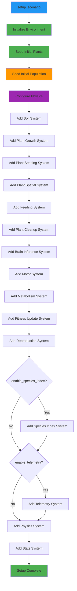

# Module: Scenario

## Overview

The scenario module provides the primary entry point for configuring and initializing evolution simulations. It bundles all simulation parameters (environment, reproduction, population, telemetry) into a single configuration struct and orchestrates the complete system initialization workflow. This module is responsible for setting up terrain, soil, plants, physics, biological systems, and optional analytics in a deterministic, reproducible manner.

## Files

- `sim/include/evolution/sim/scenario.h`
- `sim/src/scenario.cpp`

## Structs

### SimulationScenario

**Purpose**: High-level configuration for running an evolution experiment.

**Responsibilities**:
- Encapsulate environment configuration (terrain, soil, plants)
- Specify reproduction and mutation parameters
- Define initial population size and RNG seeds
- Control optional features (species indexing, telemetry)
- Configure telemetry output settings and sampling

**Fields**:

- `environment` (`EnvironmentConfig`):
  - Type: `EnvironmentConfig`
  - Default: Default-initialized
  - Meaning: Terrain, soil, biome, water, and plant configuration
  - Used by: `initialize_environment()`, `seed_initial_plants()`

- `reproduction` (`genetics::ReproConfig`):
  - Type: `genetics::ReproConfig`
  - Default: Default-initialized
  - Meaning: Crossover rates, mutation rates, gene weights, mate selection parameters
  - Used by: `ReproductionSystem` constructor

- `initial_population` (`std::size_t`):
  - Type: `std::size_t`
  - Default: `24`
  - Meaning: Number of randomly generated creatures at simulation start
  - Validation: None (caller responsible for reasonable values)
  - Typical range: 10-500 for reasonable performance

- `genome_seed` (`std::uint64_t`):
  - Type: `std::uint64_t`
  - Default: `2025`
  - Meaning: Seed for initial random genome generation
  - Guarantees: Same seed produces identical initial population
  - Determinism: Critical for reproducible experiments

- `reproduction_seed` (`std::uint64_t`):
  - Type: `std::uint64_t`
  - Default: `0xBEEFu`
  - Meaning: Global seed for reproduction system RNG
  - Guarantees: Same seed produces identical mating and mutation patterns
  - Determinism: Critical for reproducible evolution

- `enable_species_index` (`bool`):
  - Type: `bool`
  - Default: `true`
  - Meaning: Whether to register and run the species clustering system
  - Effect: If `false`, no species assignment or tracking occurs
  - Use case: Disable for performance or when species analysis not needed

- `enable_telemetry` (`bool`):
  - Type: `bool`
  - Default: `true`
  - Meaning: Whether to initialize and run the telemetry system
  - Effect: If `false`, no event emission or rollup data is saved
  - Use case: Disable for production runs without analytics

- `telemetry_output_dir` (`std::string`):
  - Type: `std::string`
  - Default: `"output"`
  - Meaning: Directory path for telemetry output files
  - Validation: Directory created if missing
  - File placement: `{output_dir}/{run_id}_events.jsonl`, `{output_dir}/{run_id}_rollup.jsonl`

- `telemetry_run_id` (`std::string`):
  - Type: `std::string`
  - Default: `"default"`
  - Meaning: Identifier for this simulation run (used in output filenames)
  - Use case: Tag experiments, enable multiple runs in same directory
  - Format: Any valid filename (no path separators recommended)

- `telemetry_rollup_interval` (`double`):
  - Type: `double`
  - Default: `1.0`
  - Meaning: Time interval (seconds) between rollup aggregations
  - Special value: `0.0` disables periodic rollup
  - Effect: Controls how frequently aggregate statistics are computed

- `telemetry_buffer_size` (`std::size_t`):
  - Type: `std::size_t`
  - Default: `1000`
  - Meaning: Number of events to buffer before forced flush
  - Effect: Balances memory usage vs. I/O frequency
  - Tuning: Increase for fewer I/O operations, decrease for lower memory

- `telemetry_sampling_rate` (`double`):
  - Type: `double`
  - Default: `0.0`
  - Meaning: Fraction of entities to capture non-targeted events for
  - Range: `[0.0, 1.0]`
  - Effect: `0.0` = targeted capture only, `1.0` = capture all entities
  - Use case: Reduce data volume by sampling a subset of population

**State Management**:

- `SimulationScenario` is a POD-like struct
- No runtime state; pure configuration data
- Default initialization provides sensible defaults for all fields
- Immutable after construction (typical usage pattern)

**Thread Safety**:

- Thread-safe: Configuration is immutable during execution
- Reads from multiple threads safe (no mutation)
- Writes (construction) must complete before system use

## Public API

### setup_scenario()

```cpp
void setup_scenario(SimulationApp& app,
                   genetics::GenomeStorage& storage,
                   const SimulationScenario& scenario);
```

**Purpose**: Initializes the simulation app according to the supplied scenario configuration.

**Parameters**:

- `app` (SimulationApp&):
  - Type: Reference to simulation application instance
  - Lifetime: Must outlive all registered systems
  - Precondition: Empty app with no registered systems
  - Postcondition: App configured with all required systems and initial state
  - Usage: Typically called once at program startup

- `storage` (genetics::GenomeStorage&):
  - Type: Reference to genome storage instance
  - Lifetime: Must outlive all registered systems
  - Precondition: Empty or reusable storage
  - Postcondition: Contains all initial genomes
  - Used by: ReproductionSystem, BrainInferenceSystem, phenotype building

- `scenario` (const SimulationScenario&):
  - Type: Reference to configuration struct
  - Lifetime: Must remain valid during call (copy-on-write internally)
  - Effect: Drives all system configuration and initialization
  - Immutable: Configuration not modified during execution

**Returns**:

- `void`: No return value

**Initialization Workflow**:



**Detailed Steps**:

1. **Environment Initialization**:
   - Calls `initialize_environment(app.registry(), scenario.environment)`
   - Sets up Terrain, Soil, Biome, Water contexts
   - Registers plant spatial index service

2. **Plant Seeding**:
   - Calls `seed_initial_plants(app.registry(), scenario.environment)`
   - Spawns plants with deterministic random placement
   - Uses `scenario.environment.plants.seed` for reproducibility

3. **Population Seeding**:
   - Calls `seed_initial_population(app.registry(), storage, scenario)`
   - Creates `scenario.initial_population` creatures with random genomes
   - Uses `scenario.genome_seed` for deterministic genome generation
   - Places creatures randomly on terrain surface

4. **Physics Configuration**:
   - Creates `SimplePhysicsConfig` with terrain parameters
   - Gravity: `-9.81` m/s²
   - Ground height: `terrain.min_y()`
   - Solver: 8 iterations, 0.25 Baumgarte stabilization
   - Cell size: 1.0 meter, heightfield enabled

5. **System Registration** (in execution order):
   - `SoilSystem`: Soil moisture and nutrient simulation
   - `PlantGrowthSystem`: Plant energy accumulation and growth
   - `PlantSeedingSystem`: New plant spawning (derived seed)
   - `PlantSpatialSystem`: Plant spatial index updates
   - `FeedingSystem`: Herbivore energy intake from plants
   - `PlantCleanupSystem`: Remove depleted/dead plants
   - `BrainInferenceSystem`: Neural network evaluation
   - `MotorSystem`: Actuation to force conversion
   - `MetabolismSystem`: Basal energy consumption, death on depletion
   - `FitnessUpdateSystem`: Age and energy integral tracking
   - `ReproductionSystem`: Mate selection, crossover, mutation, spawning
   - `SpeciesIndexSystem` (optional): Species clustering and tracking
   - `TelemetrySystem` (optional): Event emission and rollup aggregation
   - `PhysicsSystem`: Physics backend execution
   - `StatsSystem`: Periodic statistics logging

6. **Context Registration** (for optional systems):
   - If `enable_species_index`: Registers `SpeciesIndexContext`
   - If `enable_telemetry`: Registers `TelemetryContext`

**Error Handling**:

- No exceptions thrown by `setup_scenario()` itself
- Individual systems may throw during construction (propagates to caller)
- Genome storage allocation failures may throw `std::bad_alloc`
- File I/O errors (telemetry) logged as warnings, do not throw

**Performance**:

- Complexity: O(P) where P = initial population
- Memory: O(P + E) where E = environment entities (plants, terrain cells)
- System registration: O(S) where S = system count (~14 systems)
- Initial state construction: Dominated by genome generation and phenotype building

### seed_initial_population()

```cpp
void seed_initial_population(entt::registry& registry,
                            genetics::GenomeStorage& storage,
                            const SimulationScenario& scenario);
```

**Purpose**: Seeds an initial population of randomly generated genomes.

**Parameters**:

- `registry` (entt::registry&):
  - Type: Reference to ECS registry
  - Lifetime: Must outlive all spawned entities
  - Precondition: Contains `Terrain` context service
  - Postcondition: Contains `initial_population` creature entities
  - Side effects: Adds entities and components to registry

- `storage` (genetics::GenomeStorage&):
  - Type: Reference to genome storage
  - Lifetime: Must outlive simulation
  - Precondition: Empty or reusable storage
  - Postcondition: Contains `initial_population` genome entries
  - Used by: Genome creation and phenotype building

- `scenario` (const SimulationScenario&):
  - Type: Reference to configuration
  - Fields used: `initial_population`, `genome_seed`
  - Effect: Controls spawn count and genome randomness
  - Determinism: Same seed produces identical genomes

**Returns**:

- `void`: No return value

**Population Seeding Algorithm**:

```
For i = 0 to initial_population - 1:
    1. Create random genome using genome_seed + i
    2. Insert genome into storage, get genome_id
    3. Create entity in registry
    4. Build phenotype for genome_id (attach all components)
    5. Place entity at random terrain position:
       - Sample X in [0, terrain_width * cell_size)
       - Sample Z in [0, terrain_height * cell_size)
       - Y = terrain.height(X, Z)
    6. Assign name: "creature_{genome_id}"
    7. If telemetry enabled:
       - Emit ENTITY_SPAWN event (genome_id, initial:true)
       - Emit GENOME_TRAITS event (trait vector)
```

**Error Handling**:

- If terrain service missing: Logs warning, returns without spawning
- If phenotype build fails: Logs warning, destroys entity, continues
- Genome storage errors: Propagates to caller (may throw)

**Telemetry Emission**:

- Emits `ENTITY_SPAWN` event for each spawned creature:
  ```json
  {
    "entity_id": 42,
    "genome_id": 1001,
    "initial": true
  }
  ```
- Emits `GENOME_TRAITS` event for each spawned creature:
  ```json
  {
    "genome_id": 1001,
    "traits": [0.2, 0.8, -0.1, 0.5, 0.3, 0.7, 0.9, -0.2]
  }
  ```
- Events only emitted if `TelemetryContext` available
- Force capture enabled for all initial population entities

**Performance**:

- Complexity: O(P × G) where:
  - P = initial population size
  - G = genome generation cost (depends on genome complexity)
- Phenotype building: O(C) per entity where C = component count
- Memory: O(P × C) for component data
- Telemetry: O(P) event emissions (buffered or immediate)

**Thread Safety**:

- **Not thread-safe**: All operations mutate ECS registry and storage
- Must be called from single simulation thread
- Registry and storage must not be accessed concurrently

## Data Contracts

### Scenario ↔ EnvironmentBootstrap

**Contract**: Scenario provides environment configuration to bootstrap systems.

**Data Flow**:
- `setup_scenario()` → `initialize_environment(registry, scenario.environment)`
- `setup_scenario()` → `seed_initial_plants(registry, scenario.environment)`

**Configuration Provided**:
- `TerrainConfig`: Terrain generation parameters
- `SoilConfig`: Soil simulation parameters
- `BiomeConfig`: Biome map parameters
- `WaterConfig`: Water map parameters
- `PlantBootstrapConfig`: Initial plant count and energy

**Guarantees**:
- Environment services registered in registry context
- Plants spawned with deterministic placement
- Terrain heightfield available for physics and entity positioning

### Scenario ↔ GenomeStorage

**Contract**: Scenario uses genome storage for initial population and reproduction.

**Data Flow**:
- `seed_initial_population()` → `storage.create_random()` (initial genomes)
- `ReproductionSystem` (registered by scenario) → `storage.get()` / `storage.insert()`

**Access Patterns**:
- Write: `seed_initial_population()` inserts `initial_population` genomes
- Write: Reproduction system inserts offspring genomes
- Read: Reproduction system reads parent genomes

**Guarantees**:
- All initial genomes have valid IDs
- Genome IDs unique within storage
- Genome storage outlives all registered systems

### Scenario ↔ ReproductionSystem

**Contract**: Scenario configures reproduction system with evolution parameters.

**Data Flow**:
- `setup_scenario()` passes `scenario.reproduction` to ReproductionSystem constructor
- `setup_scenario()` passes `scenario.reproduction_seed` to ReproductionSystem constructor

**Configuration Provided**:
- `ReproConfig`: Crossover rates, mutation rates, gene weights
- `reproduction_seed`: Global RNG seed for deterministic mating

**Guarantees**:
- Reproduction system uses provided config for all evolutionary operations
- Same seed produces identical mating/mutation patterns across runs

### Scenario ↔ SpeciesIndexSystem

**Contract**: Scenario optionally configures species clustering system.

**Data Flow**:
- If `scenario.enable_species_index == true`:
  - Register `SpeciesIndexSystem` with scheduler
  - Pass `scenario.reproduction` config
  - Register `SpeciesIndexContext` in registry

**Configuration Provided**:
- `ReproConfig`: Used for trait weights and thresholds

**Guarantees**:
- Species system only runs if enabled in scenario
- Species context registered in registry for querying

### Scenario ↔ TelemetrySystem

**Contract**: Scenario optionally configures telemetry for analytics.

**Data Flow**:
- If `scenario.enable_telemetry == true`:
  - Register `TelemetrySystem` with scheduler
  - Pass output directory, run ID, sampling rate, rollup config
  - Register `TelemetryContext` in registry

**Configuration Provided**:
- `telemetry_output_dir`: Output file path
- `telemetry_run_id`: Run identifier (filename prefix)
- `telemetry_sampling_rate`: Fraction of entities to sample
- `telemetry_rollup_interval`: Time between rollups (seconds)
- `telemetry_buffer_size`: Event buffer size before flush

**Guarantees**:
- Telemetry only emits if enabled in scenario
- Output directory created if missing
- Events buffered and flushed periodically
- Rollup data aggregated at configured interval

### Scenario ↔ Physics

**Contract**: Scenario configures physics backend with terrain parameters.

**Data Flow**:
- `setup_scenario()` retrieves `Terrain` from registry
- Creates `SimplePhysicsConfig` with terrain `min_y()` for ground height
- Constructs `SimplePhysicsBackend` with config
- Registers `PhysicsSystem` with backend

**Configuration Provided**:
- Gravity: `-9.81` m/s² (constant)
- Ground height: `terrain.min_y()`
- Cell size: `1.0` meter
- Solver iterations: `8`
- Baumgarte stabilization: `0.25`
- Penetration slop: `0.01`
- Heightfield enabled: `true`

**Guarantees**:
- Physics matches terrain geometry
- Creatures interact with terrain surface
- Deterministic physics (backend is deterministic)

## Dependencies

### Internal Dependencies

- `evolution/sim/simulation_app.h`: SimulationApp interface
- `evolution/sim/environment/environment_bootstrap.h`: Environment initialization
- `evolution/sim/soil_system.h`: Soil simulation
- `evolution/sim/plant_systems.h`: Plant growth and seeding
- `evolution/sim/feeding_system.h`: Herbivore feeding
- `evolution/sim/brain_inference_system.h`: Neural inference
- `evolution/sim/motor_system.h`: Actuation to forces
- `evolution/sim/metabolism_system.h`: Energy consumption
- `evolution/sim/fitness_update_system.h`: Fitness tracking
- `evolution/sim/reproduction_system.h`: Reproduction and mutation
- `evolution/sim/species_index_system.h`: Species clustering
- `evolution/sim/telemetry_system.h`: Event analytics
- `evolution/sim/physics_system.h`: Physics integration
- `evolution/sim/physics/simple_backend.h`: Simple physics backend
- `evolution/sim/stats_system.h`: Statistics logging
- `evolution/genetics/genome_storage.h`: Genome storage
- `evolution/genetics/phenotype_builder.h`: Phenotype building
- `evolution/genetics/trait_extraction.h`: Trait vector extraction

### External Dependencies

- **EnTT**: ECS framework (registry, entity operations)
- **spdlog**: Logging (info, warn levels)
- **std::filesystem**: Path handling for telemetry output

## Extension Points

### Custom System Registration

**Add Custom Systems After setup_scenario()**:

```cpp
SimulationApp app;
genetics::GenomeStorage storage;
SimulationScenario scenario;

setup_scenario(app, storage, scenario);

// Add custom systems
app.scheduler().add_system(std::make_unique<MyCustomSystem>());

// Run simulation
app.run_for_steps(1000);
```

**Note**: Custom systems execute after all built-in systems. For different ordering, manually replicate `setup_scenario()` logic.

### Override Default Configuration

**Modify SimulationScenario Before setup_scenario()**:

```cpp
SimulationScenario scenario;

// Customize environment
scenario.environment.terrain.width = 256;
scenario.environment.terrain.cell_size = 2.0;

// Customize population
scenario.initial_population = 100;
scenario.genome_seed = 42;

// Custom reproduction parameters
scenario.reproduction.crossover_prob = 0.8;
scenario.reproduction.mutation_rates.point_mutation = 0.05;

// Disable optional systems
scenario.enable_species_index = false;
scenario.enable_telemetry = false;

setup_scenario(app, storage, scenario);
```

### Custom Telemetry Configuration

**Advanced Telemetry Setup**:

```cpp
scenario.enable_telemetry = true;
scenario.telemetry_output_dir = "experiments/run_001";
scenario.telemetry_run_id = "baseline_population";
scenario.telemetry_rollup_interval = 5.0;  // Rollup every 5 seconds
scenario.telemetry_buffer_size = 5000;     // Buffer 5k events
scenario.telemetry_sampling_rate = 0.1;     // Sample 10% of population
```

### Custom Physics Backend

**Replace SimplePhysicsBackend**:

Currently, scenario uses `SimplePhysicsBackend`. To use a custom backend:

```cpp
// After setup_scenario(), manually re-register physics system
auto custom_backend = std::make_unique<CustomPhysicsBackend>(custom_config);
app.scheduler().add_system(std::make_unique<PhysicsSystem>(std::move(custom_backend)));
```

**Future Enhancement**: Add `physics_backend_type` field to `SimulationScenario` for backend selection.

## Performance Considerations

### Initialization Cost

- **Environment Initialization**: O(T) where T = terrain cells
- **Plant Seeding**: O(P) where P = plant count (default 500)
- **Population Seeding**: O(N × G) where:
  - N = initial population (default 24)
  - G = genome generation cost (depends on genome complexity)
- **System Registration**: O(S) where S ≈ 14 systems
- **Total**: Typically < 100ms for default configuration

### Memory Footprint

- **Scenario Config**: < 1 KB (pure data)
- **Initial Population**: O(N × C) where:
  - N = population size
  - C = components per entity (~10 components)
- **Environment**: O(T + P) where:
  - T = terrain cells
  - P = plant count
- **Systems**: O(S) where S ≈ 14 systems
- **Typical**: < 50 MB for default configuration (24 creatures, 500 plants, 128×128 terrain)

### Bottlenecks

- **Genome Generation**: Initial genomes created sequentially, cannot parallelize (determinism requirement)
- **Phenotype Building**: Each entity requires component allocation, dominates initialization time
- **Telemetry I/O**: If enabled and sampling rate high, event emission can impact startup time

### Optimization Opportunities

- **Parallel Plant Seeding**: Could parallelize plant spawning (deterministic per-cell RNG)
- **Component Pooling**: Pre-allocate component pools for initial population size
- **Lazy Telemetry**: Defer telemetry context creation until first event emission

## Testing Strategy

### Unit Tests

- **SimulationScenario Default Initialization**:
  - Verify all fields have correct default values
  - Test copy and move semantics

- **seed_initial_population()**:
  - Spawn count matches `initial_population`
  - All entities have required components
  - Genome IDs unique and valid
  - Positions on terrain surface (Y matches terrain height)
  - Names follow "creature_{genome_id}" pattern
  - Determinism: Same seed produces identical genomes
  - Terrain missing: Logs warning, no entities spawned
  - Phenotype build failure: Logs warning, entity destroyed, continues

### Integration Tests

- **setup_scenario() Full Workflow**:
  - All systems registered in correct order
  - Environment services registered in context
  - Physics configured with terrain parameters
  - Species system present if `enable_species_index == true`
  - Telemetry system present if `enable_telemetry == true`
  - Initial population spawned successfully

- **Scenario Variants**:
  - Minimal scenario (no optional systems)
  - Full scenario (all optional systems)
  - Large population (500+ creatures)
  - Large terrain (256×256 cells)

### Determinism Tests

- **Seed Reproducibility**:
  - Same `genome_seed` → identical initial genomes
  - Same `reproduction_seed` → identical reproduction decisions
  - Same configuration → identical system registration order

- **Telemetry Emission**:
  - Same scenario → identical initial population events
  - Trait vectors identical for same genomes

### Performance Tests

- **Initialization Time**:
  - Default scenario: < 100ms
  - Large population (500): < 500ms
  - Large terrain (256×256): < 200ms

- **Memory Usage**:
  - Default scenario: < 50 MB
  - Large scenario (500 creatures, 1000 plants): < 200 MB

## Related Documentation

- [Core Simulation Module](./core_simulation.md) - SimulationApp, Scheduler, System infrastructure
- [Environment Module](./environment.md) - Terrain, soil, plant systems
- [Genome Module](./genome.md) - Genome storage and operations
- [Phenotype Module](./phenotype.md) - Entity building from genomes
- [Reproduction Module](./reproduction.md) - Mating, crossover, mutation system
- [Species Index Module](./species_index.md) - Species clustering system
- [Telemetry Module](./telemetry.md) - Event analytics pipeline
- [Data Contracts](../data-contracts/inter_module_contracts.md) - Inter-module communication
