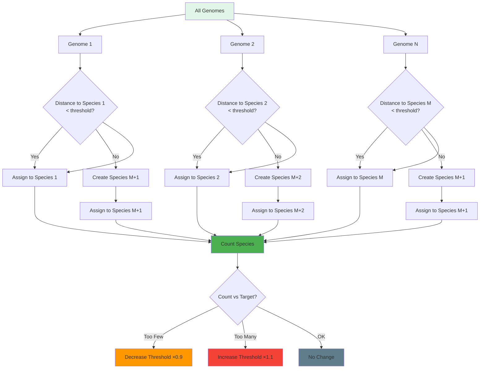

# Module: Species Index System

## Overview

The species index system clusters genomes into species using compatibility distance, providing evolutionary context for selection, fitness evaluation, and telemetry. It dynamically adjusts clustering thresholds to maintain target species diversity.

## Files

- `sim/include/evolution/sim/species_index_system.h`
- `sim/src/species_index_system.cpp`

## Classes

### SpeciesIndexSystem

**Purpose**: Species clustering and indexing for genomes.

**Responsibilities**:
- Compute all-vs-all compatibility distance matrix
- Assign species IDs using threshold-based clustering
- Auto-adjust threshold to maintain target species count
- Emit telemetry events for species creation and extinction
- Provide query API for species lookup

**Public API**:

```cpp
// Construction
explicit SpeciesIndexSystem(genetics::GenomeStorage& storage,
                           const genetics::ReproConfig& config,
                           std::size_t target_species_count = 10,
                           double initial_threshold = 3.0) noexcept;

// System interface
void tick(SimulationContext& context) override;
[[nodiscard]] std::string_view name() const noexcept override;

// Query API
[[nodiscard]] SpeciesId get_species(genetics::GenomeId genome_id) const noexcept;
[[nodiscard]] std::size_t species_count() const noexcept;
[[nodiscard]] double threshold() const noexcept;
```

**Parameters**:

- `storage` (constructor):
  - Type: `genetics::GenomeStorage&`
  - Meaning: Genome storage containing all registered genomes
  - Must outlive system instance
  - Used for: genome lookup for distance computation

- `config` (constructor):
  - Type: `const genetics::ReproConfig&`
  - Meaning: Reproduction configuration for distance computation parameters
  - Contains: gene_weights used in compatibility distance

- `target_species_count` (constructor):
  - Type: `std::size_t`
  - Meaning: Desired number of species to maintain
  - Default: `10`
  - Used for: threshold auto-adjustment feedback loop

- `initial_threshold` (constructor):
  - Type: `double`
  - Meaning: Starting compatibility distance threshold
  - Default: `3.0`
  - Units: Compatibility distance metric

**Returns**:

- `name()` → `std::string_view` literal `"species_index"`
- `get_species(genome_id)` → `SpeciesId` (or 0 if not found)
- `species_count()` → Number of distinct species
- `threshold()` → Current clustering threshold value
- `tick()` and other methods return `void`

**State Management**:

- `storage_`: Reference to genome storage (owned by caller)
- `config_`: Reproduction configuration for distance computation
- `target_species_count_`: Target species count (threshold adjustment goal)
- `threshold_`: Current compatibility distance threshold
- `species_count_`: Number of distinct species (computed each tick)
- `species_map_`: `GenomeId → SpeciesId` mapping
- `genome_list_`: Cached list of all genome IDs
- `previous_species_`: `SpeciesId` set from previous tick (for change detection)

**Thread Safety**:

- **Not thread-safe**: All methods must be called from single simulation thread
- `tick()` mutates ECS state and species mapping
- `get_species()` and `species_count()` safe for concurrent reads after tick
- `threshold()` safe for concurrent reads (read-only after tick)

**Performance**:

- `tick()`: O(N² + N × S) where:
  - N = genome count
  - S = average species count
  - Dominated by distance matrix computation
- Space overhead: O(N) for species map and genome list

## Clustering Algorithm

### Threshold-Based Greedy Assignment

**Algorithm Steps**:

```
For each genome in storage:
    1. Initialize: assigned_species = 0, min_distance = threshold
    2. For each existing species:
        - Compute compatibility distance to species representative
        - If distance < min_distance:
            - Update min_distance, assigned_species
    3. If assigned_species == 0:
        - Create new species: next_species_id++
    4. Assign: species_map_[genome_id] = assigned_species
```

**Key Characteristics**:
- **Order-dependent**: Species IDs depend on genome iteration order
- **Greedy**: First-closest species wins (not optimal, but fast)
- **Deterministic**: Same input → same clustering (given fixed order)

### Threshold Auto-Adjustment

**Feedback Loop**:

```
After clustering complete:
    current_count = number of distinct species

    if current_count < target_species_count:
        # Too few species: decrease threshold
        threshold = max(min_threshold, threshold × 0.9)

    else if current_count > target_species_count × 1.5:
        # Too many species: increase threshold
        threshold = min(max_threshold, threshold × 1.1)
```

**Adjustment Parameters**:
- `kAdjustRate = 0.1` (10% per adjustment step)
- `kMinThreshold = 0.5` (tightest allowed clustering)
- `kMaxThreshold = 10.0` (loosest allowed clustering)

**Hysteresis**:
- Adjustment only applies when outside target range
- Prevents oscillation near target count

### Compatibility Distance Metric

**Distance Function**:
- Uses `genetics::compatibility_distance(genome_a, genome_b, config)`
- Weights genes according to `gene_weights` in config
- Returns scalar distance (lower = more similar)

**Clustering Semantics**:
- Distance < threshold: Genomes belong to same species
- Distance >= threshold: Genomes belong to different species
- First genome in species sets representative for distance computation

## Species Change Detection

### New Species

**Trigger**: Genome assigned to `SpeciesId` not in `previous_species_`

**Action**: Emit telemetry event

```json
{
  "species_id": 42,
  "population": 15
}
```

**Event Type**: `SPECIES_CREATED`

### Extinct Species

**Trigger**: `SpeciesId` in `previous_species_` but not in current clustering

**Action**: Emit telemetry event

```json
{
  "species_id": 7,
  "population": 0
}
```

**Event Type**: `SPECIES_EXTINCT`

**Frequency**: At most once per tick (after clustering)

## Clustering Visualization



## Data Contracts

### SpeciesIndexSystem ↔ GenomeStorage

**Contract**: System reads all genomes for distance computation.

**Read**:
- `storage.ids()` → List of all genome IDs
- `storage.get(genome_id)` → Individual genome data
- Access pattern: Sequential reads of all genomes each tick

**Write**: None (read-only)

**Guarantees**:
- All genomes in storage considered in clustering
- Genome IDs valid (non-zero)
- Distance computations consistent with repro config

### SpeciesIndexSystem ↔ TelemetrySystem

**Contract**: System emits species change events.

**Emitted Events**:
- `SPECIES_CREATED`: New species emergence
- `SPECIES_EXTINCT`: Species extinction (population → 0)

**Change Detection**:
- Compare `previous_species_` set to current species set
- Emit only for changed species (not all species every tick)

**Data Format**:

```json
// SPECIES_CREATED
{
  "species_id": 42,
  "population": 15
}

// SPECIES_EXTINCT
{
  "species_id": 7,
  "population": 0
}
```

**Guarantees**:
- Events emitted only if `TelemetryContext` available
- Species IDs stable after clustering (not transient)
- Population counts accurate for current tick

### SpeciesIndexSystem ↔ Registry

**Contract**: System provides species mapping via context.

**Context Access**:
- Stored in `registry.ctx<SpeciesIndexContext>()`
- Exposes system instance pointer
- Lifetime: Persists for simulation duration

**Query Pattern**:

```cpp
// During other systems:
auto* ctx = registry.ctx().find<SpeciesIndexContext>();
if (ctx != nullptr && ctx->system != nullptr) {
    SpeciesId species_id = ctx->system->get_species(genome_handle.id);
}
```

**Guarantees**:
- Context exists if system registered with scenario
- Species IDs consistent with last clustering
- Query returns 0 for unknown/unassigned genomes

## Dependencies

### Internal Dependencies

- `evolution/genetics/genome_storage.h`: Genome data access
- `evolution/genetics/genome_ops.h`: Distance computation
- `evolution/sim/telemetry_system.h`: Event emission

### External Dependencies

- **EnTT**: ECS framework (registry context)
- **spdlog**: Logging (`spdlog::info` for clustering statistics)
- **Standard Library**: `<unordered_map>`, `<unordered_set>`, `<vector>`

## Extension Points

### Custom Clustering Algorithms

**Replace Greedy Assignment**:
- Modify `UpdateClustering()` to use k-means or hierarchical clustering
- Maintain same API (`get_species()`, `species_count()`)
- Update complexity documentation accordingly

**Adaptive Threshold Strategy**:
- Replace linear adjustment with PID controller
- Add hysteresis parameters (deadband size)
- Consider fitness diversity metrics in adjustment

### Species Metadata

**Add Species Descriptors**:
- Store representative genome per species
- Track species creation time, extinction time
- Maintain per-species fitness statistics

## Performance Considerations

### Optimization Strategies

- **Genome List Caching**: Cache `storage.ids()` in `genome_list_` to avoid repeated calls
- **Distance Memoization**: Cache computed distances (future optimization)
- **Sparse Updates**: Run clustering only when new genomes added (not every tick)

### Bottlenecks

- **All-vs-All Distance**: O(N²) scaling, prohibitive for N > 10k genomes
- **Threshold Adjustment**: Frequent updates may oscillate around target
- **Species Change Detection**: Set operations O(S) where S = species count

**Recommended Mitigation**:
- Periodic clustering (every 60 ticks vs every tick)
- Incremental distance updates (only for new genomes)
- Sparse distance matrix (exploit compatibility function properties)

## Testing Strategy

- **Unit Tests**:
  - Threshold adjustment logic
  - Species change detection (previous vs current)
  - Query API with known genome IDs
- **Integration Tests**:
  - Full clustering with genome storage
  - Species ID assignment consistency
  - Telemetry event emission
- **Determinism Tests**:
  - Same input → identical species assignments
  - Reproducible threshold adjustments
- **Performance Tests**:
  - 1k genomes at 60 Hz tick cadence
  - 10k genomes (stress test clustering time)

## Related Documentation

- [Genome Module](./genome.md) - Genome storage and distance computation
- [Data Contracts](../data-contracts/genetics.md) - Species indexing data flows
- [Core Simulation Module](./core_simulation.md) - System execution infrastructure
